# Fit Finder

## Table of Contents
- [Description](#description)
- [Technologies](#technologies)
    - [Installation Instructions](#installation-instructions)
- [Development Process](#development-process)
  - [User Stories](#user-stories)
  - [Wireframes](#wireframes)
  - [Results](#results)
- [Hurdles](#hurdles)
- [Credits](#credits)
  - [Sources](#sources)
  - [Acknowledgments](#acknowledgments)

---

# Description

Fit Finder aims to improve users' health by enhancing their fitness journey. Fit Finder serves to meet the needs of two user groups - gym goers and gym owners.
Both groups can use Fit Finder to connect, find specific facilities and services, and grow their community.

Fit Finder is an Angular application that allows users to access and manage gym data. 
* Users can view gyms, as well as the equipment and amenities the gyms offer. 
* Gym owners can register for an account, allowing them to list their gyms and gym offerings.

To see how this application handles data, check out the [Fit Finder API backend application](https://github.com/knnguyen2410/fit-finder-backend) which it communicates with.

---

# Technologies

Below is a comprehensive list of technologies used during Fit Finder's development.

- **Angular**: The frontend framework used for development.
- **Jasmine**: The behavior-driven development (BDD) testing framework utilized for writing unit tests.
- **VS Code**: The code editor used during development.
- **TypeScript**: The programming language used in conjunction with Angular.
- **HTML5**: The markup language utilized for structuring the contents of angular components.
- **CSS3**: The stylesheet language used for styling the contents of angular components.
- **Bootstrap**: The CSS framework used to create responsive and visually appealing single plage application.
- **Git**: Used for version control on local computer and pushing changes to remote repository.
- **GitHub**: The hosting service for the remote repository, used for version control and branch management.
    - **[Github Projects](https://github.com/users/knnguyen2410/projects/3/views/3)**: Used for project planning and documentation of deliverables and timelines.
- **Google Chrome**: The browser used for accessing the H2 database engine.
- **Google Docs**: The document editor used to take notes and ideas during development process.
- **Chat GPT**: The artificial intelligence chatbot developed by OpenAI.

## Installation Instructions

This project was generated with [Angular CLI](https://github.com/angular/angular-cli) version 16.0.2. 

Run `ng serve` for a dev server. Navigate to `http://localhost:4200/`. The application will automatically reload if you change any of the source files.

---

# Development Process

To ensure a systematic and efficient development process, I started by wireframing the pages for the Fit Finder Angular application. As the backend REST API was already created, I had a clear understanding of the necessary components and how data should be displayed to both logged-in and non-logged-in users.

Following the wireframes, I adopted an incremental development approach. I began building the application one component at a time, focusing on functionality and data flow. After completing each component, I ran Jasmine tests to verify that everything was functioning correctly. This iterative testing approach allowed me to catch any issues early on and maintain code quality.

Once I had the minimum required data displayed, I proceeded to implement the next features of the site. By breaking down the development process into manageable chunks, I ensured that each feature was implemented thoroughly before moving on to the next one.

After completing all the features, I revisited the application's styling. This approach aligned with the principles of Agile methodology, allowing me to deliver a fully functional product that met the requirements. By prioritizing functionality first and then refining the design, I was able to maintain an efficient development pace and deliver a polished end product in a timely manner.

By adhering to this development process and adopting an agile mindset, I ensured that the Fit Finder Angular application was developed systematically, thoroughly tested, and met the requirements of the project.

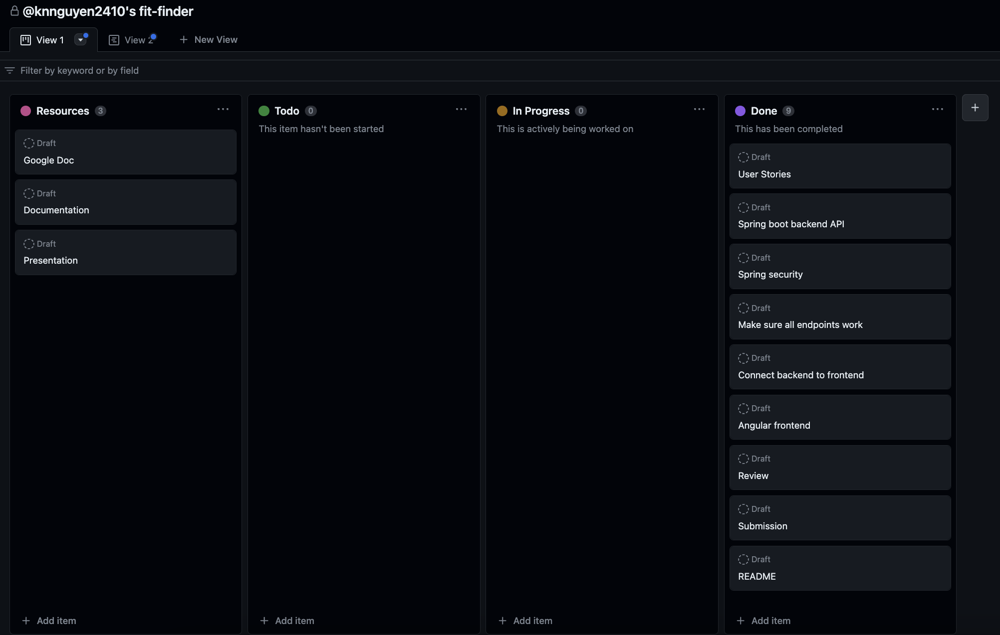
[Github Projects](https://github.com/users/knnguyen2410/projects/3/views/3) was used for planning documentation, breaking down this project into deliverables and timelines, and scheduling.

## User Stories

Owner
- As an unregistered owner, I want to create an account, so that I can list my gyms.
- As a registered owner, I want to log into my account, so that I can manage my account and gyms.
- As an unregistered owner, I want to view all gym owners, so that I can see who has created an account.
- As a registered owner, I want to view my account, so that I can see my information.
- As a user, I want to view all gyms belonging to an owner, so that I can see the gyms the owner has.

Gym
- As a registered owner, I want to list a gym I own, so that my gym details are available to the public.
- As a user, I want to view all gyms, so that I can see a list of gyms available
- As a user, I want to see the details of a specific gym, so that I can see what the gym offers.
- As a registered owner, I want to remove a gym I own from the listing, so that its information is no longer available to the public.

Equipment
- As a registered owner, I want to add a a piece of equipment to a gym I own, so that the public knows the gym has this equipment.
- As a user, I want to see all equipment a gym offers, so that I can compare equipment between gyms.
- As a registered owner, I want to unlist a piece of equipment for a gym I own, so that the public knows the equipment is no longer available.

Amenity
- As a registered owner, I want to add an amenity to a gym I own, so that the public knows the gym has this amenity.
- As a user, I want to see all amenities a gym offers, so that I can compare equipment between gyms.
- As a registered owner, I want to unlist an amenity for a gym I own, so that the public knows the amenity is no longer available.

## Wireframes

Home Page
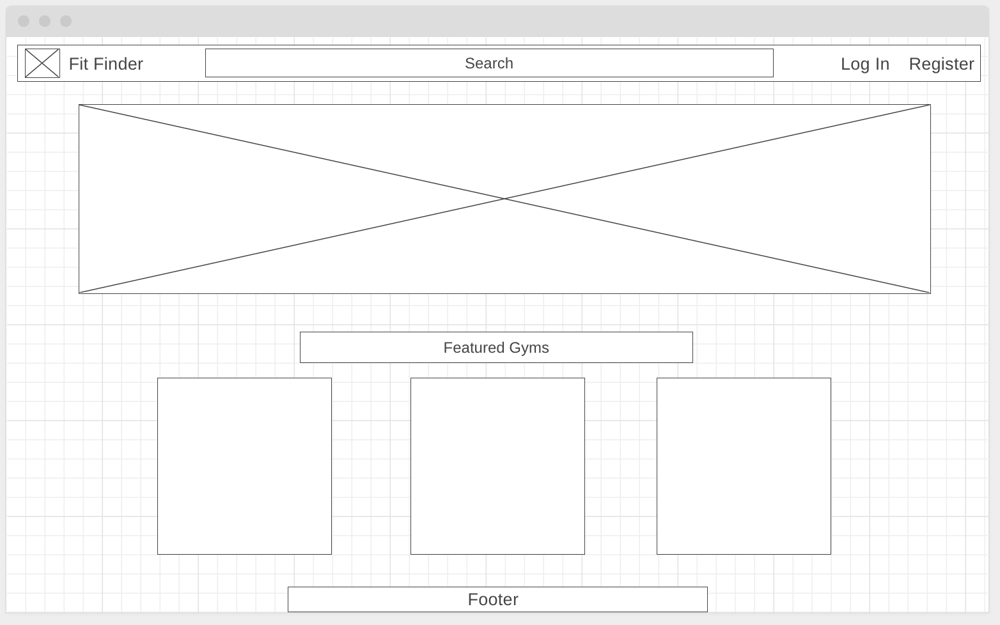

Owner Account Page
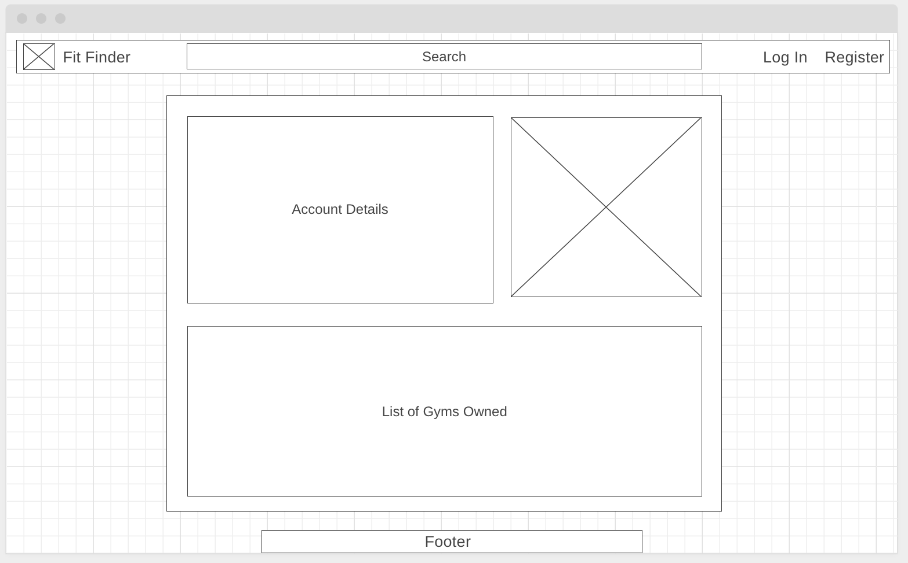

Search Results Page
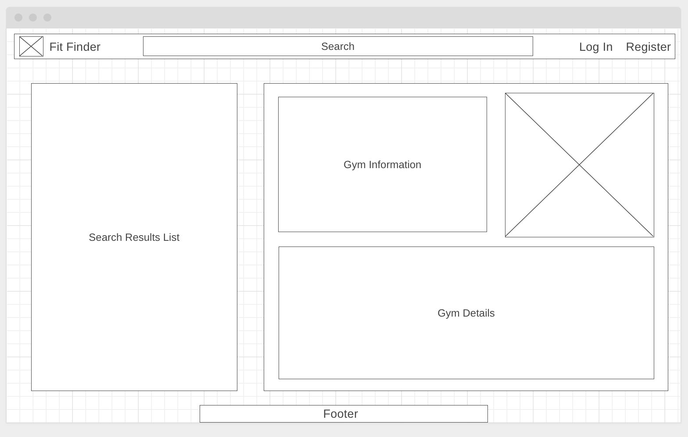

Login Page
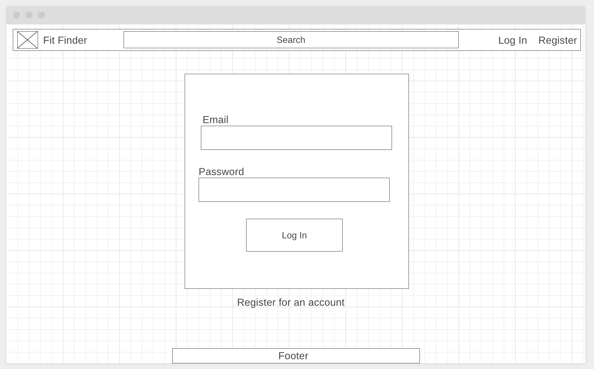

Registration Page
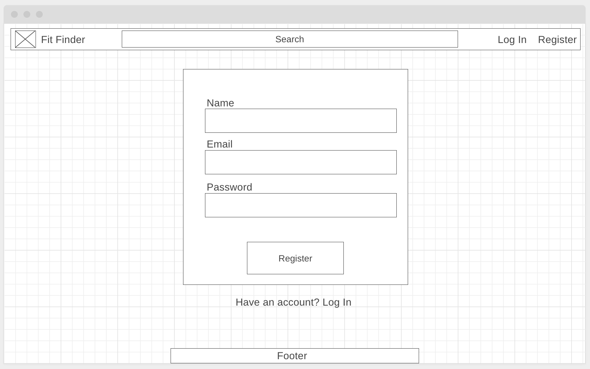

## Results

Home Page

About Page

Owner Profile Page
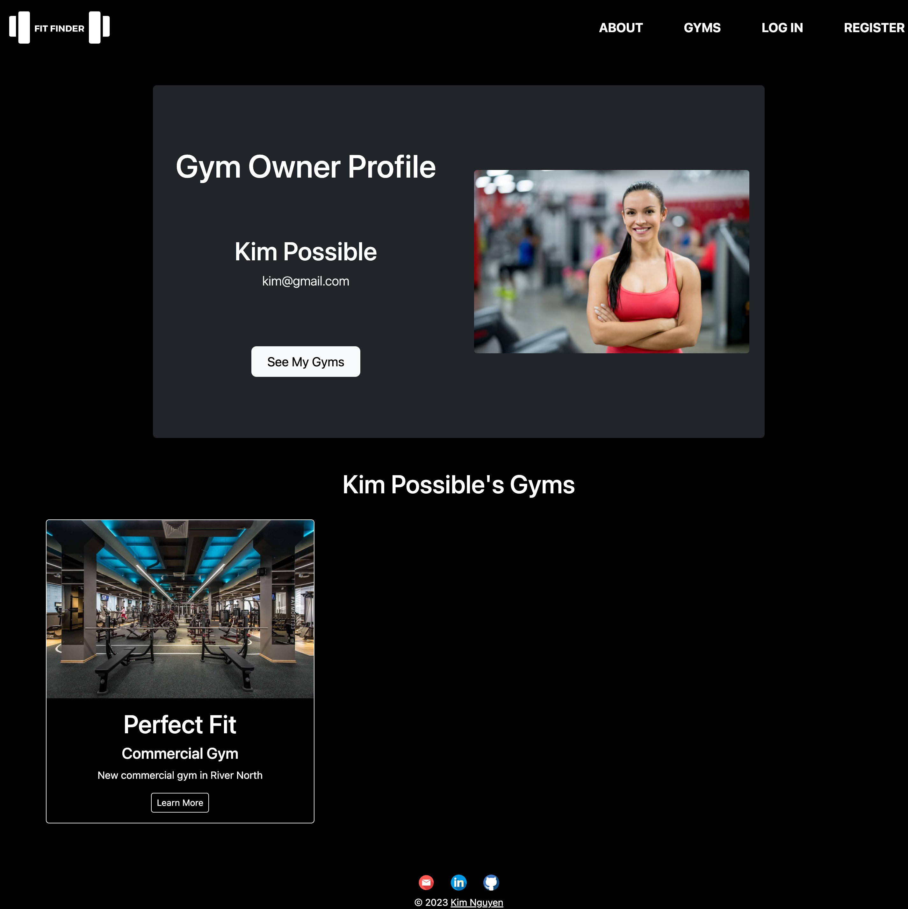

Search Results Page
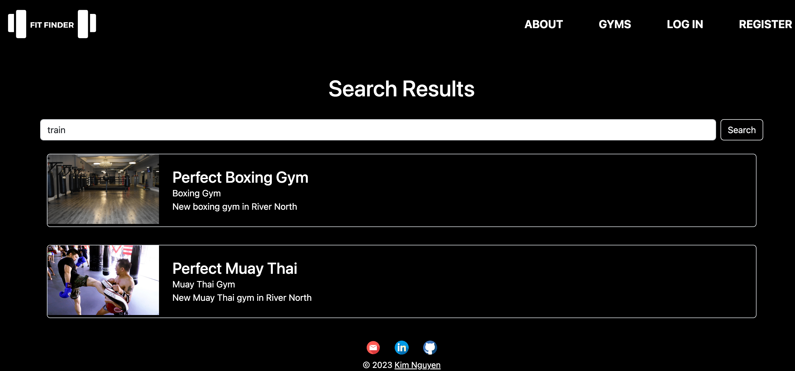

All Gyms Page            | All Gyms Page (logged in)
:-----------------------:|:----------------------:
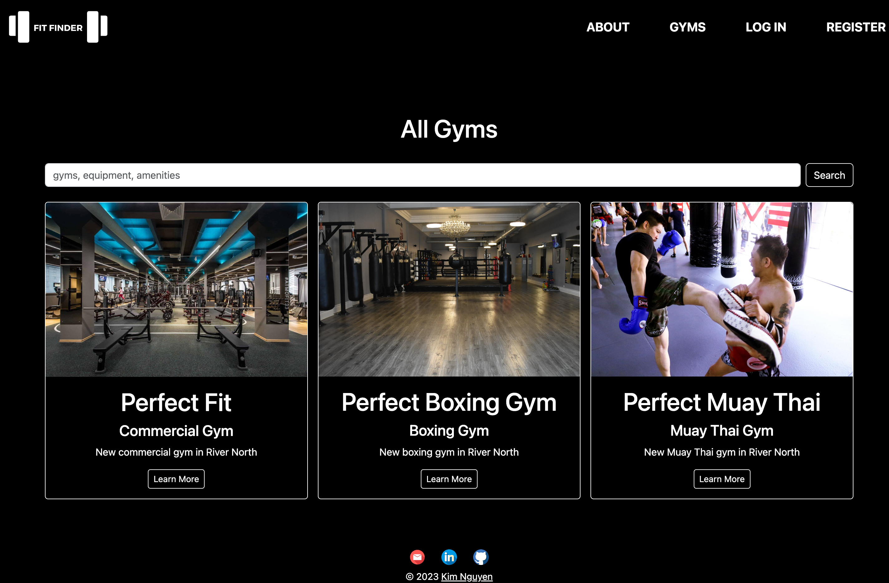 | 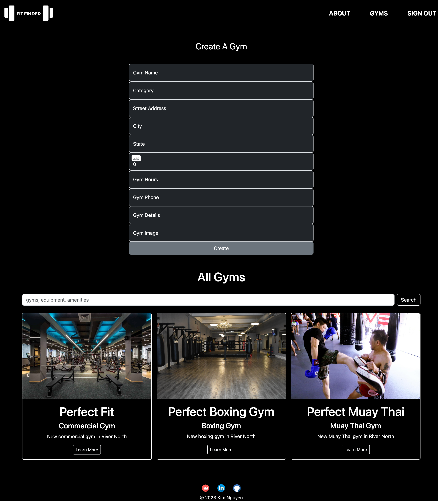

Gym Profile Page         | Gym Profile Page (logged in)
:-----------------------:|:----------------------:
 | 

Login Page
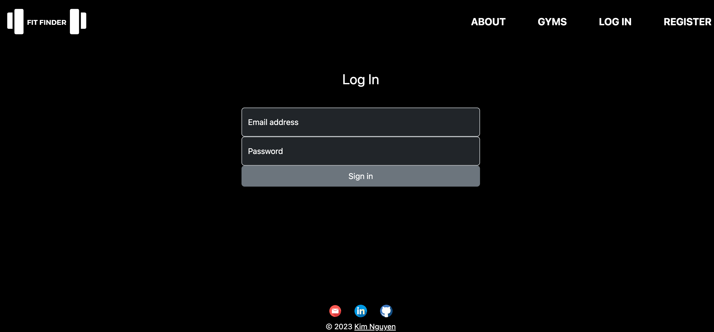

Register Page
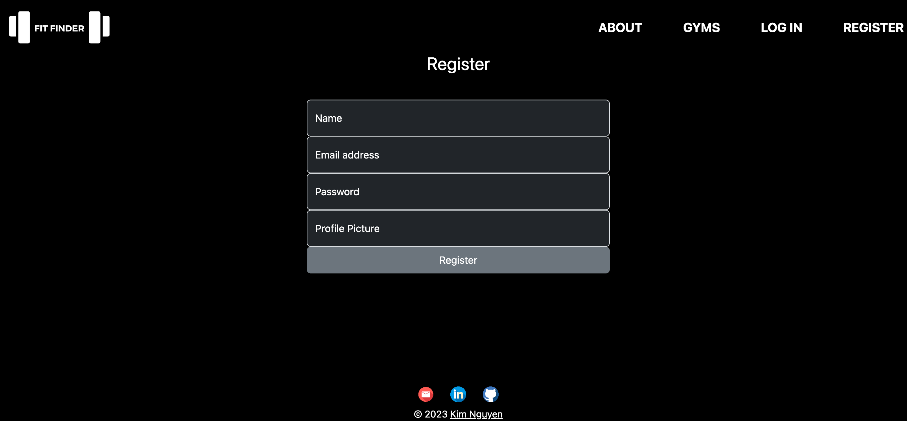

---

# Hurdles

Throughout the development process of the Fit Finder Angular application, I encountered several significant hurdles that tested my problem-solving skills and required proactive communication with instructors and peers.

One of the challenges I faced was integrating Bootstrap into the project. While learning Angular, I also had to familiarize myself with Bootstrap, which added an additional learning curve. I had to understand how to structure content on a page, retrieve data, and dynamically route components based on the data. This complexity posed a significant challenge that required careful attention and problem-solving.

Another major hurdle I encountered was ensuring secure access to endpoints using JSON Web Tokens (JWT). I needed to pass the security JWT to my endpoints to restrict access to only logged-in owners who could modify gym data. Implementing this authentication and authorization mechanism was a complex task that involved understanding the flow of tokens and securely passing them through the application.

To overcome these hurdles, I employed a proactive approach. I engaged in open communication with my instructors and peers, seeking their guidance and expertise. By breaking down the challenges into smaller segments, I was able to analyze and debug my code effectively. Through collaborative discussions and feedback, I gained insights and discovered solutions to address the specific hurdles I faced.

By embracing a proactive and collaborative mindset, I successfully navigated through the challenges encountered during the development process. These hurdles not only tested my technical skills but also provided valuable learning opportunities and fostered growth as a developer.

---

Silver:
* Full CRUD.
* Authentication.

Future Features (create bronze, silver, gold)
Future endpoints: Delete owner by id, Update gym, owner, equipment, amenity
External link for signing up on their gym website
Ai images - edge
Open api to document endpoints
Ai integration
Google maps api - kevin
Multi.tech
Open API for api documentation
Make hero image autoplay
Sign up for membership
& restricted components
Add exceptions when there’s no gyms, equipment, or amenities
Be able to gracefully handle exceptions when they occur. - no gyms/amenities/equipment found

# Credits

## Sources

- [Angular Documentation](https://angular.io/docs)
- [Bootstrap Documentation](https://getbootstrap.com/docs/5.3/getting-started/introduction/)
- [Connecting frontend and backend with CORS](https://www.stackhawk.com/blog/angular-cors-guide-examples-and-how-to-enable-it/)
- Images and Videos:
    - https://www.pexels.com/ 
    - https://pixabay.com/ 
    - https://www.flaticon.com/
    - https://www.canva.com/create/logos/
    - Seed data images can be found in the seed-data-sources.txt file

## Acknowledgments

I have immense gratitude to my instructors and peers who have taught me so much during this development process. Please see their GitHub accounts below:
- [Leonardo Rodriguez](https://github.com/LRodriguez92)
- [Suresh Sigera](https://github.com/sureshmelvinsigera)
- [Maksym Zinchenko](https://github.com/maklaut007)
- [Kevin Barrios](https://github.com/dayjyun)
- [Jaime Padilla](https://github.com/Jaypad07)
- [Trevor Hendricks](https://github.com/t-hendricks)
- [Pam Afaneh](https://github.com/pammie89)

[Go to top](#fit-finder)